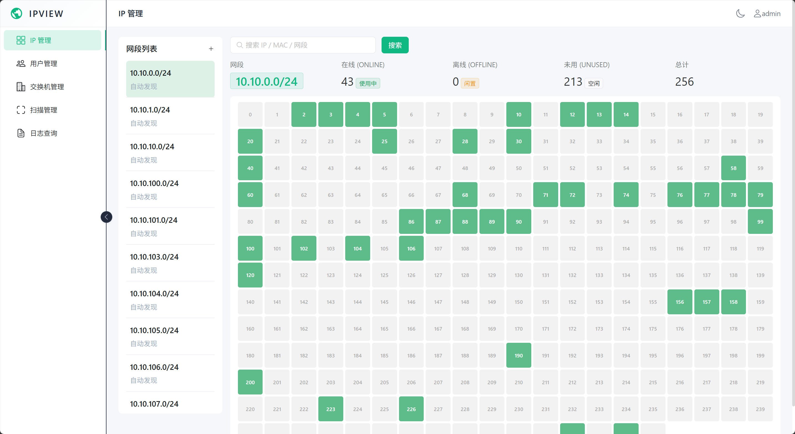

# IPView - IP 地址监控与管理系统

<p align="center">
  
  
  
  
  
  
</p>

基于 **FastAPI + Vue 3 + PostgreSQL + Redis + Celery** 的企业级 IP 地址监控与管理系统，通过 SNMP 协议自动采集核心交换机 ARP 表，实时掌握全网 IP 使用状态。

---



## 功能特性

- **IP 可视化监控** — 20 列网格化展示整个 /24 网段（254 个 IP），在线/离线/空闲一目了然
- **智能搜索** — 支持 IP、MAC 地址、网段 CIDR 快速定位
- **SNMP 自动扫描** — 定时采集核心交换机 ARP 表，支持 SNMPv1/v2c/v3
- **网段自动发现** — 扫描时自动根据发现的 IP 创建 /24 网段
- **入库网段过滤** — 可配置仅允许指定网段的 IP 入库
- **MAC 变更追踪** — Tooltip 悬浮展示 IP 历史 MAC 变化记录
- **完整审计日志** — 登录日志 + 扫描日志，支持自动/手动清理
- **RBAC 权限控制** — admin / user 两级角色
- **TOTP 多因素认证** — 支持 Google Authenticator 等 TOTP 应用
- **数据加密存储** — TOTP 密钥、SNMPv3 配置使用 Fernet 加密

## 技术栈

| 层级 | 技术 |
|------|------|
| 后端 | FastAPI + SQLAlchemy 2.0 + Pydantic v2 |
| 前端 | Vue 3 + Naive UI + TypeScript + Axios |
| 数据库 | PostgreSQL 16（INET/CIDR 原生类型） |
| 缓存 | Redis 7 |
| 异步任务 | Celery 5 + Beat 定时调度 |
| SNMP | pysnmp 6（lextudio） |
| 部署 | Docker Compose |


## 快速启动

### Docker Compose（推荐）

```bash
git clone https://github.com/monstertsl/IPView.git
cd IPView
docker-compose up -d
```

启动后访问：

| 服务 | 地址 |
|------|------|
| 前端 | http://localhost:3000 |
| 后端 API | http://localhost:8000 |
| API 文档 | http://localhost:8000/docs |

默认管理员账号：`admin` / `admin123`

> **提示**：首次使用请在「交换机管理」添加交换机后执行扫描，系统会自动发现并创建网段。

### 本地开发

**后端**

```bash
cd backend
python -m venv venv
source venv/bin/activate  # Windows: venv\Scripts\activate
pip install -r requirements.txt

# 配置环境变量
cp .env.example .env

# 启动 API 服务
uvicorn app.main:app --reload --port 8000

# 启动 Celery Worker（新终端）
celery -A celery_app worker --loglevel=info

# 启动 Celery Beat（新终端）
celery -A celery_app beat --loglevel=info
```

**前端**

```bash
cd frontend
npm install
npm run dev
```

## 项目结构

```
IPView/
├── backend/
│   ├── app/
│   │   ├── api/            # API 路由（ip, scan, switch, user, log）
│   │   ├── core/           # 核心模块（config, database, auth, redis, security）
│   │   ├── models/         # SQLAlchemy ORM 模型
│   │   ├── schemas/        # Pydantic 请求/响应模型
│   │   ├── services/       # 业务服务（SNMP 扫描器）
│   │   ├── tasks/          # Celery 异步任务（扫描、定时清理）
│   │   └── main.py         # FastAPI 应用入口
│   ├── celery_app.py       # Celery 配置
│   ├── Dockerfile
│   └── requirements.txt
├── frontend/
│   ├── src/
│   │   ├── api/            # Axios 实例与拦截器
│   │   ├── router/         # Vue Router 路由配置
│   │   ├── types/          # TypeScript 类型定义
│   │   ├── views/          # 页面组件
│   │   ├── App.vue
│   │   └── main.ts
│   ├── Dockerfile
│   └── package.json
├── docker-compose.yml
└── README.md
```

## 数据库模型

| 表名 | 说明 |
|------|------|
| `users` | 用户账号（密码 bcrypt 加密，TOTP 密钥 Fernet 加密） |
| `switches` | 交换机（SNMPv3 配置 Fernet 加密） |
| `ip_subnets` | IP 网段（CIDR，支持自动发现） |
| `ip_records` | IP 当前状态（PostgreSQL INET 原生类型） |
| `ip_events` | IP 历史事件（MAC 变更追踪） |
| `scan_subnets` | 入库网段过滤规则 |
| `scan_tasks` | 扫描任务记录 |
| `scan_logs` | 扫描执行日志 |
| `login_logs` | 用户登录日志 |
| `system_config` | 系统全局配置 |

## API 概览

### 认证

| 方法 | 路径 | 说明 |
|------|------|------|
| POST | `/api/auth/login` | 登录（支持 TOTP） |
| POST | `/api/auth/logout` | 登出 |
| POST | `/api/auth/check-user` | 检查用户状态 |

### IP 管理

| 方法 | 路径 | 说明 |
|------|------|------|
| GET | `/api/ip/subnets` | 网段列表 |
| POST | `/api/ip/subnets` | 添加网段（自动预填充 IP） |
| DELETE | `/api/ip/subnets/{id}` | 删除网段 |
| GET | `/api/ip/subnets/{id}/ips` | 获取网段完整 IP 列表（254 个） |
| GET | `/api/ip/search?q=` | 搜索 IP / MAC / 网段 |
| GET | `/api/ip/ip/{ip}/tooltip` | IP 详情与历史 MAC |

### 用户管理（admin）

| 方法 | 路径 | 说明 |
|------|------|------|
| GET | `/api/users` | 用户列表 |
| POST | `/api/users` | 创建用户 |
| PATCH | `/api/users/{id}` | 更新用户 |
| DELETE | `/api/users/{id}` | 删除用户 |
| POST | `/api/users/{id}/totp/enable` | 启用 TOTP |
| POST | `/api/users/{id}/totp/disable` | 禁用 TOTP |

### 交换机管理（admin）

| 方法 | 路径 | 说明 |
|------|------|------|
| GET | `/api/switches` | 交换机列表 |
| POST | `/api/switches` | 添加交换机 |
| PATCH | `/api/switches/{id}` | 更新交换机 |
| DELETE | `/api/switches/{id}` | 删除交换机 |
| POST | `/api/switches/test` | 测试 SNMP 连接 |

### 扫描管理（admin）

| 方法 | 路径 | 说明 |
|------|------|------|
| GET | `/api/scan/config` | 获取扫描配置 |
| PATCH | `/api/scan/config` | 更新扫描配置 |
| POST | `/api/scan/tasks/now` | 立即执行扫描 |
| GET | `/api/scan/tasks` | 扫描任务历史 |
| GET | `/api/scan/logs` | 扫描日志 |
| GET/POST/DELETE | `/api/scan/subnets` | 入库网段管理 |

### 日志查询

| 方法 | 路径 | 说明 |
|------|------|------|
| GET | `/api/logs/login` | 登录日志（分页） |
| GET | `/api/scan/logs` | 扫描日志 |
| POST | `/api/logs/cleanup` | 手动清理日志 |

## 权限矩阵

| 模块 | admin | user |
|------|:-----:|:----:|
| IP 管理 | ✅ | ✅ |
| 用户管理 | ✅ | ❌ |
| 交换机管理 | ✅ | ❌ |
| 扫描管理 | ✅ | ❌ |
| 日志查询 | ✅ | ❌ |

## 安全说明

- 用户密码 bcrypt 加密存储
- TOTP 密钥、SNMPv3 配置使用 Fernet（PBKDF2）对称加密
- 所有 API 接口需 Bearer Token（JWT）认证
- 登录连续失败 5 次自动禁用账号
- SQL 查询使用 SQLAlchemy ORM 参数化，防注入
- 所有输入经 Pydantic v2 严格校验

## 故障恢复

无法登录前端时，可通过命令行直接操作。以下命令中 `ipview-postgres-1` 和 `ipview-backend-1` 为默认容器名。

### 查看用户状态

```bash
docker exec -it ipview-postgres-1 psql -U postgres -d ipview -c \
  "SELECT username, role, is_active, totp_enabled, failed_login_attempts, auth_mode FROM users;"
```

```
 username | role  | is_active | totp_enabled | failed_login_attempts | auth_mode
----------+-------+-----------+--------------+-----------------------+-----------
 admin    | admin | f         | t            |                     5 | password
```

### 重置用户密码

**第一步：生成密码哈希**（将 `newpassword` 替换为你要设置的密码）

```bash
docker exec -it ipview-backend-1 python -c \
  "from passlib.context import CryptContext; print(CryptContext(schemes=['bcrypt']).hash('newpassword'))"
```

输出示例：`$2b$12$LJ3m4ys4Rz...`

**第二步：更新数据库**（将 `$2b$12$...` 替换为上一步的输出）

```bash
docker exec -it ipview-postgres-1 psql -U postgres -d ipview -c \
  "UPDATE users SET password_hash='\$2b\$12\$LJ3m4ys4Rz...' WHERE username='admin';"
```

### 解锁被禁用的账号

登录连续失败 5 次后账号会被自动禁用，使用以下命令解锁：

```bash
docker exec -it ipview-postgres-1 psql -U postgres -d ipview -c \
  "UPDATE users SET failed_login_attempts=0, is_active=true WHERE username='admin';"
```

### 一键重置（密码 + 解锁 + 禁用 TOTP）

最常见的场景——忘记密码 + 账号被锁 + TOTP 丢失，一条命令全部搞定，密码重置为 `admin123`：

```bash
docker exec -it ipview-backend-1 python -c "
from passlib.context import CryptContext
import subprocess, sys
h = CryptContext(schemes=['bcrypt']).hash('admin123')
sql = f\"UPDATE users SET password_hash='{h}', failed_login_attempts=0, is_active=true, totp_enabled=false, totp_secret_encrypted=null, auth_mode='password' WHERE username='admin';\"
subprocess.run(['psql', '-h', 'postgres', '-U', 'postgres', '-d', 'ipview', '-c', sql], env={**__import__('os').environ, 'PGPASSWORD': 'postgres'})
"
```

### 禁用 TOTP

```bash
docker exec -it ipview-postgres-1 psql -U postgres -d ipview -c \
  "UPDATE users SET totp_enabled=false, totp_secret_encrypted=null WHERE username='admin';"
```

### 切换认证模式为纯密码

如果用户被设为 TOTP-only 模式导致无法登录：

```bash
docker exec -it ipview-postgres-1 psql -U postgres -d ipview -c \
  "UPDATE users SET auth_mode='password', totp_enabled=false, totp_secret_encrypted=null WHERE username='admin';"
```

### 创建新管理员

当所有管理员账号都无法恢复时，可直接创建一个新的：

```bash
docker exec -it ipview-backend-1 python -c "
from passlib.context import CryptContext
import subprocess, os
h = CryptContext(schemes=['bcrypt']).hash('admin123')
sql = f\"INSERT INTO users (id, username, password_hash, role, auth_mode, is_active, totp_enabled, failed_login_attempts, created_at) VALUES (gen_random_uuid(), 'newadmin', '{h}', 'admin', 'password', true, false, 0, now()) ON CONFLICT (username) DO NOTHING;\"
subprocess.run(['psql', '-h', 'postgres', '-U', 'postgres', '-d', 'ipview', '-c', sql], env={**os.environ, 'PGPASSWORD': 'postgres'})
"
```

## License

MIT
